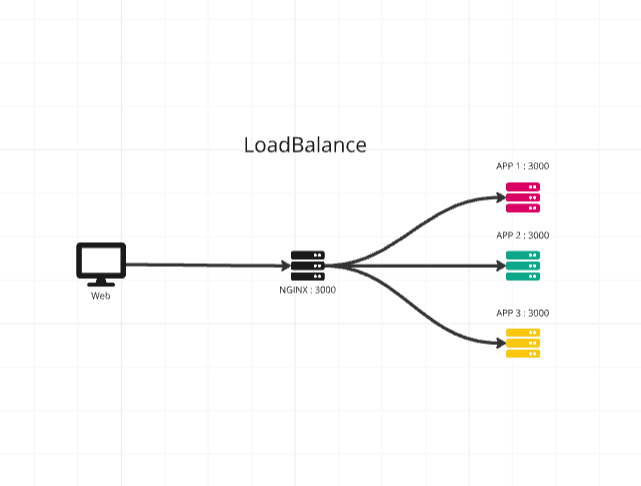

# การทำ Load Balancing ด้วย Docker, Nginx และ Go



โปรเจ็กต์นี้แสดงตัวอย่างวิธีการทำ Load Balancing โดยใช้ Docker, Docker Compose, Nginx และแอปพลิเคชัน Go อย่างง่าย โดย Nginx ทำหน้าที่เป็น reverse proxy เพื่อลดภาระการทำงานให้กับสอง container ของแอปพลิเคชัน Go (`app1` และ `app2`)

## โครงสร้างของโปรเจ็กต์
```
├── docker-compose.yml   # ไฟล์หลักในการตั้งค่า service
├── nginx                # โฟลเดอร์ที่เก็บไฟล์ config ของ Nginx
│   └── nginx.conf       # ไฟล์ config ของ Nginx สำหรับ load balancing
└── app                  # โฟลเดอร์ที่เก็บโค้ดแอปพลิเคชัน Go
    └── main.go          # ไฟล์แอปพลิเคชัน Go
```


## ขั้นตอนการติดตั้ง

### 1. Clone โปรเจ็กต์จาก GitHub

```bash
git clone https://github.com/BasZ4ll/load-balance
cd load-balance

1. การตั้งค่า Nginx
ไฟล์คอนฟิกของ Nginx กำหนดการตั้งค่า Load Balancing โดยจะส่งต่อ request ไปยัง app1 หรือ app2 ตามการตั้งค่าแบบ round-robin


2 ไฟล์คอนฟิก Nginx (nginx/nginx.conf)


3. คอนฟิก Docker Compose
ไฟล์ docker-compose.yml กำหนดค่า service ทั้งหมด 3 ส่วน:

app1: Container ของแอป Go ตัวแรก
app2: Container ของแอป Go ตัวที่สอง
nginx: Container ของ Nginx ทำหน้าที่เป็น reverse proxy และ load balancer

```

## Docker 
สร้างและรัน Container
ใช้คำสั่งนี้เพื่อสร้างและเริ่มต้น container:

```
docker-compose up --build
```